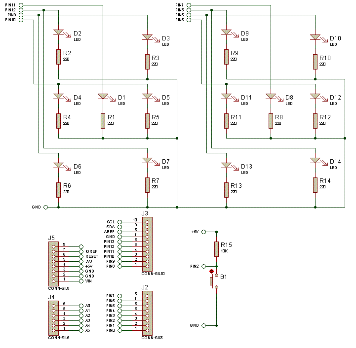
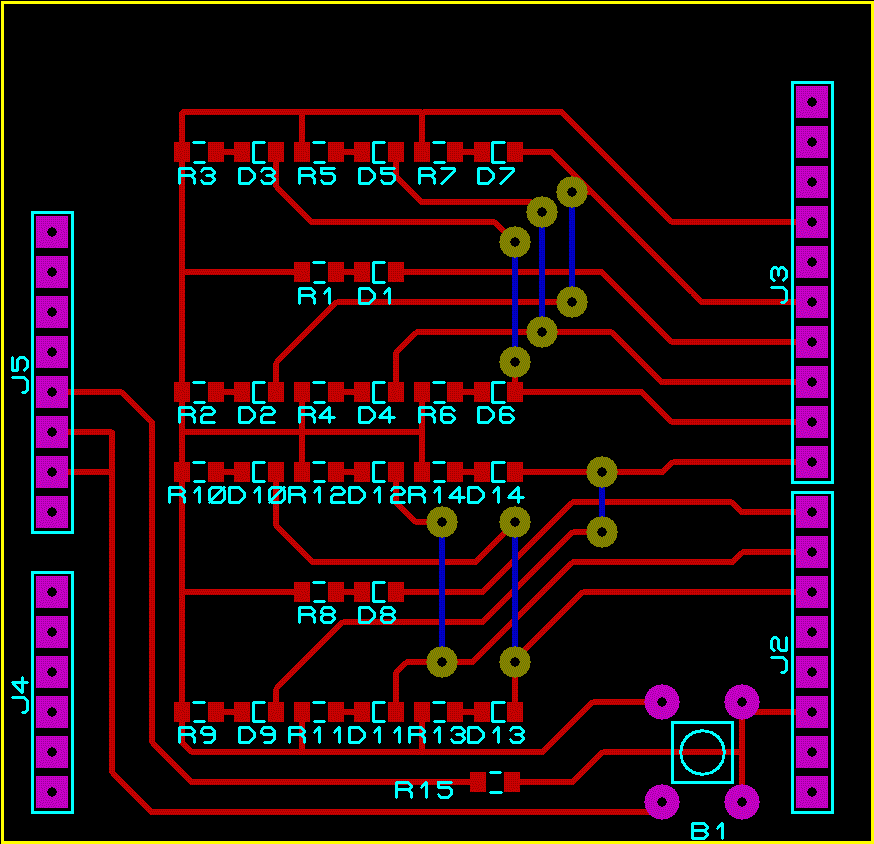

# TAVLA ZARI 

ARRDUINO UNO Shield tarzýnda baskýlý devreside tasarlanmýþ olan tavla zarý uygulamasý.

Devrenin baskýlý devre çizimi tek yüzlü olarak özellikle okul ortamýnda kolayca üretilebilsin amacýyla tasarlandý.
LED lerin ve dirençlerin SMD-0805 þeklinde kullanýlmasýyla da öðrencilerin yüzey montaj elemanlarýn lehimlenmesi konusunda tecrübe kazanmalarý saðlandý.

#Devre þemasý

#PCB cizimi

Yapacak arkadaþlara baþarýlar dilerim.
Hüseyin SERÝMER